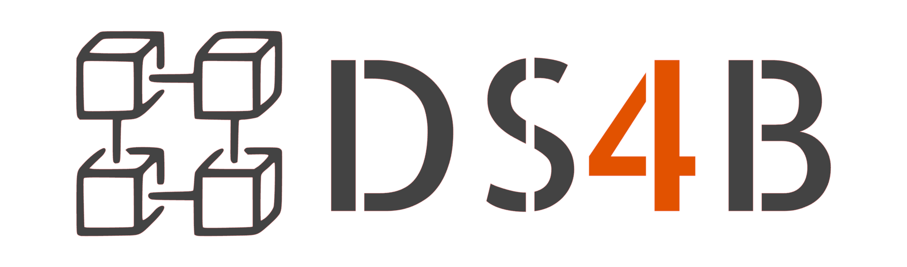
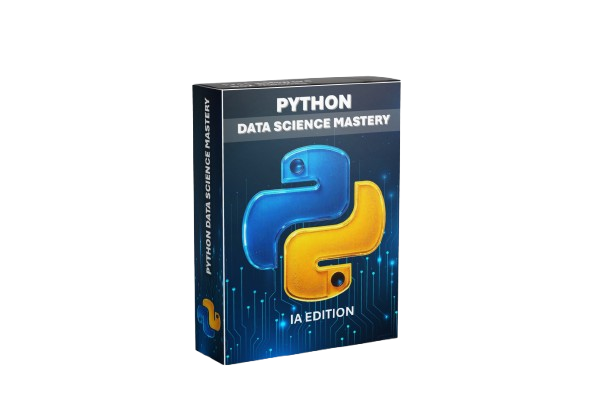

# Tu primera semana como Data Scientist

> *"Como pasamos de tener unos datos de empleados a una propuesta de retención del talento."*

En esta experiencia de [**Data Science for Business**](https://datascience4business.com/) recorrerás un proyecto
paso a paso: analizarás un problema de negocio, construirás un modelo
predictivo y utilizarás sus resultados en un dashboard con informes
personalizados mediante inteligencia artificial.

No necesitas haber trabajado antes en un proyecto de Data Science.
Los notebooks y las lecciones te guiarán durante el recorrido.

## El reto: entender y anticipar el abandono de empleados

Trabajaremos con información sobre los perfiles y las condiciones
laborales de una plantilla para responder a preguntas como:

- ¿Qué patrones encontramos entre los empleados que abandonan?
- ¿Qué coste económico puede representar su salida?
- ¿Qué perfiles presentan mayor riesgo según el modelo?
- ¿Qué acciones de retención podemos valorar para cada empleado?

El objetivo es conectar el análisis de datos con decisiones de negocio.

## El recorrido

### Día 1 · Entender el negocio y explorar los datos

Prepararás tu espacio de trabajo, conocerás los datos y realizarás
los primeros análisis de Business Analytics.

Explorarás el abandono de empleados, identificarás patrones y
estimarás su impacto económico.

### Día 2 · Construir e interpretar un modelo

Prepararás las variables y entrenarás un árbol de decisión para
estimar el riesgo de abandono.

Aprenderás a leer el árbol, interpretar sus reglas y exportar los
resultados que alimentarán la aplicación.

### Día 3 · Convertir el análisis en un producto

Ejecutarás un dashboard preparado con Streamlit para explorar
la plantilla y localizar los perfiles prioritarios.

Con tu propia clave de Gemini podrás generar informes personalizados
con propuestas de retención basadas en la información del empleado
y las reglas del modelo.

## Empieza aquí

Todo el trabajo puede realizarse desde el navegador con GitHub Codespaces.

1. Crea una cuenta de GitHub o inicia sesión.
2. Pulsa **Fork** para crear una copia de este repositorio en tu cuenta.
3. Dentro de tu copia, abre **Code → Codespaces → Create codespace on main**.
4. Espera a que termine la preparación del entorno.
5. Abre `notebooks/TPS_Dia_1_Business_Analytics.ipynb` y sigue la lección.

El proyecto incluye la configuración de Python y las librerías
necesarias para trabajar.

Tu Codespace se ejecutará en tu propia cuenta de GitHub y utilizará
la disponibilidad de recursos de tu cuenta.

## ¿Dónde están los siguientes notebooks?

Este repositorio incluye el notebook del día 1.

Los notebooks de los días 2 y 3 estarán disponibles en la plataforma
para su descarga, Cuando los tengas, añádelos a la carpeta `notebooks` 
de tu copia del proyecto.

Conserva sus nombres y sigue las instrucciones de cada jornada.

## Inteligencia artificial con tu propia clave

Para generar los informes del día 3 necesitarás una clave personal
de la API de Gemini.

En el día 3 te enseñaremos a generarla y a configurar GitHub para que
todo funcione perfectamente.

No necesitas una clave para empezar el análisis del día 1.
La disponibilidad de Gemini dependerá de los modelos y las cuotas
habilitados para tu cuenta.

## Herramientas que utilizarás

- **Python y Jupyter:** trabajar paso a paso con los datos.
- **pandas y NumPy:** preparar y analizar la información.
- **Matplotlib:** visualizar los resultados.
- **scikit-learn:** construir el modelo predictivo.
- **Streamlit:** explorar los resultados en un dashboard.
- **Gemini:** redactar propuestas de retención en lenguaje natural.

Las predicciones orientan el análisis: no garantizan que un empleado
vaya a abandonar ni que una acción concreta evite su salida.

